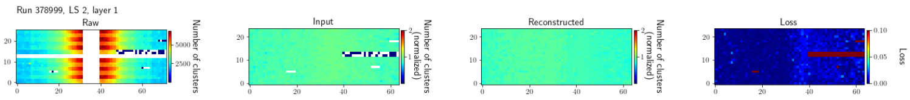

# Pixel-AE: anomaly detection in the CMS pixel tracker DQM data

### Introduction
This is a repository for anomaly detection studies in the DQM data of the CMS pixel tracker.

It was originally developed with an autoencoder in mind (hence the ae in pixelae),
but the current studies use non-negative matrix factorization (NMF) instead.
See [studies/clusters_2024](https://github.com/LukaLambrecht/pixelae/tree/main/studies/clusters_2024)
for the specific implementation of the latest ongoing studies (at the time of writing),
and in particular [studies/clusters_2024/nmf](https://github.com/LukaLambrecht/pixelae/tree/main/studies/clusters_2024/nmf)
for the NMF definition, training, and evaluation.

Regardless of the specific method, this repository contains some [tools](https://github.com/LukaLambrecht/pixelae/tree/main/tools)
(e.g. for loading the input data, getting and handling relevant info from OMS, and common data manipulations).
There is also some code for [plotting](https://github.com/LukaLambrecht/pixelae/tree/main/plotting) (to be improved),
[job submission to HTCondor](https://github.com/LukaLambrecht/pixelae/tree/main/jobsubmission) from `lxplus`,
and handling [automasks](https://github.com/LukaLambrecht/pixelae/tree/main/automasking).

### Input data
Most of the functionality in this repository starts from per-lumisection DQMIO data,
stored in the form of [pandas dataframes](https://pandas.pydata.org/docs/reference/api/pandas.DataFrame.html) in [parquet](https://parquet.apache.org/) files.

The retrieval and parsing of the input data is not within the scope of this repository,
but here are some useful links:
- For data retrieval from DIALS \[[1](https://cmsdials.web.cern.ch/?ws=tracker), [2](https://gitlab.cern.ch/cms-dqmdc/services/dials-service)\] (recommended), see [dialstools/datasets](https://github.com/LukaLambrecht/dialstools/tree/main/datasets).
- For data retrieval directly from the DQMIO datasets centrally maintained by CMS (no longer recommended but might work as backup), see [dqmiotools/datasets](https://github.com/LukaLambrecht/dqmiotools/tree/main/datasets).

### How to run
Most of the code runs in the form of IPython notebooks (e.g. on SWAN).
Some dependencies might not be installed by default on SWAN (to double check, it has been a while),
but in that case they should be easily installable by `pip install <package name>` in the SWAN terminal.

The python scripts (e.g. for HTCondor job submission) run on `lxplus`,
(after sourcing a relatively recent CMSSW version to have at least most dependencies available;
I used `CMSSW_14_1_0_pre4` but the exact version shouldn't matter).
